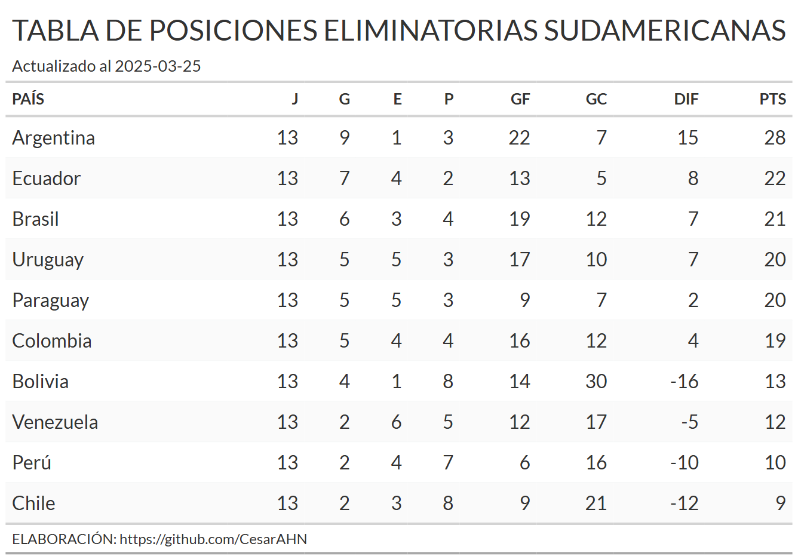

```{r, echo = FALSE}
knitr::opts_chunk$set(
  collapse = TRUE,
  comment = "#",
  fig.path = "README-"
)
```

# BIENVENIDOS!!!

# PROBABILIDADES DE CLASIFICAR AL MUNDIAL 2026 - ELIMINATORIAS SUDAMÉRICA.

Se crea este repertorio para poder determinar las probabilidades de cada una de las selecciones de la CONMEBOL, para clasificar al mundial 2026. Para tal fin, primero se crea una función que permita calcular los resultados posibles de los partidos (goles a favor, goles en contra, diferencia de goles, puntos y puesto).

Una vez que se obtiene la función se realiza un proceso montecarlo con el cual se evalúa la función 50 000 veces. Con lo cual se obtiene 50 000 resultados posibles por cada partido. 

Al final se calcula las probabilidades en función a los resultados posibles que se obtendrían en la fecha 18 de las clasificatorias. 

USted encuentra todo el código en este repositorio, el archivo se llama **sc_simulacion_eliminatorias.R**

## Tabla de posiciones. 
Se obtendrá la tabla de posiciones dese la web de espn, actualizado a la fecha `r Sys.Date()`. Para esto se usa el método de web scraping. 

```{r, message=FALSE, warning=FALSE, echo=FALSE}
library(dplyr)
library(rvest)
#devtools::install_github("CesarAHN/datametria")
library(datametria)
library(ggplot2)
library(tidyr)
library(gt)
#devtools::install_github("jthomasmock/gtExtras")
library(gtExtras)
library(ggridges)

```

```{r,message=FALSE, warning=FALSE, echo=FALSE, cache=TRUE}
#----------------------
# Tabla de posiciones. 
#----------------------
pw<-read_html("https://www.espn.com.pe/futbol/posiciones/_/liga/fifa.worldq.conmebol")

tab_pos<-pw %>% html_elements("table.Table.Table--align-right") %>% html_table() %>% as.data.frame() %>% as_tibble()
gsub("(.*)([A-Z].*)","\\2",tab_pos$X2023)->tab_pos$X2023
names(tab_pos)[1]<-"PAÍS"
tab_pos$PAÍS<-ifelse(tab_pos$PAÍS=="Bolívia","Bolivia",tab_pos$PAÍS)
```

```{r, eval=FALSE}
tab_pos %>% as_tibble() %>% gt() %>%
  gt_theme_espn() %>% tab_header(title = "TABLA DE POSICIONES ELIMINATORIAS SUDAMERICANAS",
                                 subtitle = paste0("Actualizado al ", Sys.Date())) %>% 
  tab_source_note("ELABORACIÓN: https://github.com/CesarAHN")
```

<p align="center"></p>

## El calendario de partidos pendientes.

Para el calendrio, se usa como fuente wikipedia.

```{r}
#-------------
# Calendario.
#-------------
pw<-read_html("https://es.wikipedia.org/wiki/Clasificaci%C3%B3n_de_Conmebol_para_la_Copa_Mundial_de_F%C3%BAtbol_de_2026")

fechas<-pw %>% html_elements("#mw-content-text > div.mw-content-ltr.mw-parser-output > table:nth-child(34)") %>%
  html_table() %>% as.data.frame()

fechas %>% filter(grepl("vs",Resultado)) %>% select(Var.3,Var.7) %>% rename(Local=Var.3,Visitante=Var.7)->tab_calendario

```

## Desempeño de las selecciones. 

Todas las selecciones no tienen el mismo desempeño, por lo cual se crea un tipo de índice de desempeño en donde se consideran 2 características: el puntaje de desempeño como visitante, el puntaje de desempeño como local. Estas características reciben puntajes desde 0 hasta 1, en donde 0 significa que el club tiene un desempeño paupérrimo, mientras que 1 significa que su desempeño es sobresaliente. 

Los dos puntajes son arbitrarios ya que el desempeño de partidos pasados no es indicador del desempeño futuro de un club, por más objetivo que se piense que es. Por lo cual, solo se podría indicar que tan buenos son de visita (primera característica), o que tan buenos son de locales (segunda característica)

En ese sentido los puntajes lo he asignado en función a mis conocimientos deportivos. Usted puede asignar otros puntajes y obtendrá resultados distintos, pero es importante no perder la objetividad. 

A continuación muestro el puntaje para cada una de los clubes y sus respectivos scores de visita y local.

como se mencionó, previamente, los scores pueden ser determinados, a través, de un modelo que considere variables observables. Pero eso lo abordaremos en la siguiente actualización del repositorio.

```{r, echo=FALSE, cache=TRUE}
#------------------------
# Puntajes de desempeño.
#------------------------
# Puntaje de juego de local
# De 1 al 10, donde 1 es que le va muy mal jugando de visita y 10 que le va muy bien.
p_local<-tibble(PAÍS=sort(tab_pos$PAÍS), `PUNTAJE LOCAL`=c(9,7,7,5,7.5,7,7,5,7.5,6)/10)

# Puntaje de juego de visita 
# De 1 al 10, donde 1 es que le va muy mal jugando de local y 10 que le va muy bien.
p_visita<-tibble(PAÍS=sort(tab_pos$PAÍS), `PUNTAJE VISITA`=c(8,3.5,6,4,7,6,5,4,6.5,5.5)/10)

pp<-plyr::join_all(list(p_local,p_visita), by="PAÍS", type = "inner") %>% as_tibble()
```


```{r, eval=FALSE}
pp %>% as_tibble() %>% gt() %>%
  gt_theme_espn() %>% 
  tab_header(title = "ÍNDICE DE DESEMPEÑO DE LOCAL Y VISITANTE PARA CADA UNA DE LAS SELECCIONES",
             subtitle = "Puntajes según juicios de expertos") %>% 
  tab_source_note("ELABORACIÓN: https://github.com/CesarAHN")
```
<p align="center"></p>

## Función para el cálculo de resultados.

Se crea la función que determinará el resultado de cada partidos. Esta función considera dos argumentos: la tabla de posiciones consolidada hasta la fecha y el desempeño de las selecciones. 

La función es la siguiente:

```{r}
simulador_partidos<-function(tab_pos,pp,tab_calendario){
  #---------------------
  # Partidos por jugar.
  resultados<-data.frame()
  for (i in 1:nrow(tab_calendario)) {
    d<-(1-(pp[pp$PAÍS %in% tab_calendario[i,1],2]-pp[pp$PAÍS %in% tab_calendario[i,2],3])) %>% pull()
    if(d<1){
      a1<-rbind(data.frame(PAÍS=tab_calendario[i,1], GF_=sample(0:4,1, prob = c(1*d/10,2*d/10,3*d/10,4*d/10,(1-d)))),
                data.frame(PAÍS=tab_calendario[i,2], GF_=sample(0:4,1, prob = c((1-d),5*d/14,4*d/14,3*d/14,2*d/14)))) 
    } else {
      d<-(1-(pp[pp$PAÍS %in% tab_calendario[i,2],2]-pp[pp$PAÍS %in% tab_calendario[i,1],3])) %>% pull()
      a1<-rbind(data.frame(PAÍS=tab_calendario[i,2], GF_=sample(0:4,1, prob = c(1*d/10,2*d/10,3*d/10,4*d/10,(1-d)))),
                data.frame(PAÍS=tab_calendario[i,1], GF_=sample(0:4,1, prob = c((1-d),5*d/14,4*d/14,3*d/14,2*d/14)))) 
    }
    a1$GC_<-rev(a1$GF_)
    a1$PTS_<-ifelse(a1$GF_>a1$GC_,3,
                    ifelse(a1$GF_==a1$GC_,1,0))
    a1$G_<-ifelse(a1$PTS_==3,1,0)
    a1$P_<-rev(a1$G_)
    a1$E_<-ifelse(a1$PTS_==1,1,0) 
    resultados<-rbind(resultados,a1)
  }
  resultados %>% group_by(PAÍS) %>% mutate(n=1) %>% summarise_all(~sum(.))->resultados
  
  tab_pos_final<-left_join(tab_pos,resultados, by="PAÍS")
  
  tab_pos_final<-tab_pos_final %>% mutate(J=J+n, G=G+G_, E=E+E_, P=P+P_, GF=GF+GF_, GC=GC+GC_,
                                          PTS=PTS+PTS_, DIF=GF-GC) %>% select(!matches("_|^n$")) %>% arrange(-PTS,-DIF,-G) %>% 
    mutate(PUESTO=1:n())
  
  return(tab_pos_final)
}
```

la función es un fiel reflejo de la realidad en donde para determinar si un club ganará, empatará o perderá depende del número de goles que se realizan en cada partido. El número de goles viene determinado por el desemepeño de cada club (score de visita y score de local). El impacto se puede observar en la parte `prob = c(1*d/10,2*d/10,3*d/10,4*d/10,(1-d))` y `prob = c((1-d),5*d/14,4*d/14,3*d/14,2*d/14))`. En la cual existe una mayor probabilidad de ganar siempre y cuando el score ya se de local o de visita es mayor, pero como sabemos que en el fútbol nada está determinado, esta cantidad de goles viene determinado por un **proceso aleatorio, lo cual permite que el número de goles no dependa exclusivamente de los ratios, sino también del azar**. 

## Simulación a lo Montecarlo - 50 000 veces.

Se obtendrán los resultados como si se jugara cada partido 50 000 veces. Para esto usamos el método de montecarlo. 
```{r, eval=FALSE}
# Para tomar menos tiempo - Código eficiente.
# asignando el número de repeticiones.
repeticiones<-50000
resul<-data.frame(PAÍS=vector("character",length = repeticiones*10),
                  PTS=vector("numeric",length = repeticiones*10),
                  PUESTO=vector("integer",length = repeticiones*10))

# Corriendo el número de repeticiones.
for (i in 1:repeticiones) {
  resul[(10*(i-1)+1):(10*(i-1)+10),]<-simulador_partidos(tab_pos,pp,tab_calendario)[,c(1,9,10)]
}
```

Este proceso demora un varios minutos[^1], por lo que si usted desea aumentar el número de evaluaciones tendrá que considerar el tiempo de ejecución. Asimismo, al ser un proceso aleatorio el resultado que se obtiene en este proyecto, puede resultar distinto al suyo cuando corra el código, al margen de si dejo el desempeño sin modificaciones, esto debido a que está por detrás un proceso aleatorio. Pero los resultados no tendrán variaciones significativas, ya que el número de veces que se repitió el proceso es relativamente grande como para obtener resultados radicalmente diferentes.   

[^1]: En mi PC demoró aproximadamente 18 minutos. Tiene las siguientes características: Sistema operativo Windows 11, 16GB de RAM, Core i7 12 generación y 12 núcleos.  


## Resultados.

```{r, eval=FALSE, echo=FALSE}
saveRDS(resul, "C:/OTROS/probabilidades-eliminatorias-sudamerica-mundial-2026/simulaciones.rds")
```


```{r, echo=FALSE}
resul<-readRDS("C:/OTROS/probabilidades-eliminatorias-sudamerica-mundial-2026/simulaciones.rds")
```

### Distribución de posibles puntajes al terminar las eliminatorias.

```{r, warning=FALSE, message=FALSE, echo=FALSE, fig.width=12, fig.height=7}
resul %>% arrange(PAÍS) %>% 
  ggplot(aes(x=PTS))+
  geom_density(fill="sienna2", alpha=.7)+
  facet_wrap(~PAÍS, scales = "free")+
  scale_x_continuous(breaks = seq(0,45,by=10), limits = c(9,50))+
  labs(title = "DISTRIBUCIÓN DE LOS POSIBLES PUNTAJES POR SELECCIONES",
       subtitle = "Eliminatorias sudamerica - Mundial 2026.", x="Puntos", y="Frecuencia",
       caption = "Resultados luego de 50 000 repeticiones.\nELABORACIÓN: https://github.com/CesarAHN")+
  theme_bw()+
  theme(plot.caption = element_text(face = "bold", size = 8),
        plot.title = element_text(face = "bold"))
```

### Posibles puestos en los que podrían culminar las selecciones al final de las elimintorias.
```{r, warning=FALSE, message=FALSE, echo=FALSE, fig.width=12, fig.height=7}
resul %>% arrange(PAÍS) %>% 
  ggplot(aes(x=PUESTO))+
  geom_histogram(fill="skyblue3", alpha=.7)+
  facet_wrap(~PAÍS, scales = "free_x")+
  scale_x_continuous(breaks = seq(1,20,by=1))+
  labs(title = "DISTRIBUCIÓN DE LOS POSIBLES PUESTOS POR SELECCIONES",
       subtitle = "Eliminatorias sudamerica - Mundial 2026.", x="Puestos", y="Frecuencia",
       caption = "Resultados luego de 50 000 repeticiones.\nELABORACIÓN: https://github.com/CesarAHN")+
  theme_bw()+
  theme(plot.caption = element_text(face = "bold", size = 8),
        plot.title = element_text(face = "bold"))
```

## Probabilidades de terminar en puestos de clasificación. 

A continuación se muestra las probabilidades de los puestos en los que finalizaría cada una de las selecciones.

```{r, echo=FALSE, warning=FALSE, message=FALSE}
logos<-data.frame(PAÍS=sort(unique(tab_pos$PAÍS)),
                     LOGO=c("https://cdn-icons-png.flaticon.com/512/197/197573.png", # Argentina
                            "https://cdn-icons-png.flaticon.com/512/197/197504.png", # Bolivia.
                            "https://cdn-icons-png.flaticon.com/512/3909/3909370.png", # Brasil
                            "https://cdn-icons-png.flaticon.com/512/197/197586.png", # Chile.
                            "https://cdn-icons-png.flaticon.com/512/197/197575.png", # Colombia.
                            "https://cdn-icons-png.flaticon.com/512/197/197588.png", # Ecuador
                            "https://cdn-icons-png.flaticon.com/512/197/197376.png", # Paraguay.
                            "https://cdn-icons-png.flaticon.com/512/197/197563.png", # Peru
                            "https://cdn-icons-png.flaticon.com/512/197/197599.png", # Uruguay.
                            "https://cdn-icons-png.flaticon.com/512/197/197580.png")) # Venezuela
resul<-left_join(resul, logos)
```

### Probabilidades por cada selección al terminar las eliminatorias.
```{r, eval=FALSE}
resul %>% group_by(LOGO) %>% count(PUESTO) %>% mutate(p=n/50000) %>% select(-n) %>% 
  mutate(PUESTO=paste0("PUESTO ",PUESTO)) %>% spread(PUESTO,p) %>% 
  select(LOGO,paste0("PUESTO ",1:10)) %>% as_tibble() %>% gt() %>% 
  fmt_percent(columns = matches("^PUES")) %>% fmt_missing(columns = matches("^PUES"), missing_text = "-") %>% 
  tab_header(title = "PROBABLIDADES POR PUESTO AL CULMINAR LAS ELIMINATORIAS",
             subtitle = "Eliminatorias sudamerica - Mundial 2026.") %>% 
  gt_theme_538(quiet = TRUE) %>% gt_img_rows(columns = LOGO, height = 20) %>% 
  tab_source_note("ELABORACIÓN: https://github.com/CesarAHN") %>% 
  tab_style(style = list(cell_text(align = "center")),
            locations = list(cells_body(columns = c(paste0("PUESTO ",1:10))))) %>% 
  gt_color_rows(`PUESTO 1`:`PUESTO 10`, palette = "RColorBrewer::RdBu")
```

<p align="center"></p>

El análisis se realiza por filas el cuál muestra las probabilidades de las selecciones en ocupar cada uno de los determinados puestos. Por ejemplo, Perú tiene la mayor probabilidad de quedar en el puesto 9, asimismo, Bolivia, tiene la mayor probabilidad de quedar en el puesto 7. Estos resultados si se analizan a nivel de columnas nos da el club que tiene más probabilidades de quedar en un puesto determinado, por ejemplo, el puesto 8 es más probable que sea ocupado por Venezuela.
Si cree conveniente puede aumentar el tamaño del gráfico.

## Probabilidades de clasificar directamente al mundial. 

```{r, eval=FALSE}
resul %>% as_tibble() %>% mutate(clasificacion=case_when(PUESTO<=6~"SI",
                                         TRUE~"NO")) %>% group_by(LOGO) %>% 
  count(clasificacion) %>% mutate(p=n/50000) %>% select(-n) %>% 
  spread(clasificacion,p) %>% arrange(-SI) %>% as_tibble() %>% filter(!is.na(SI)) %>% gt() %>% 
  fmt_percent(column = c(NO,SI)) %>% fmt_missing(columns = c("NO","SI"), missing_text = "") %>% 
  tab_header(title = "PROBABLIDADES DE CLASIFICAR DIRECTO AL MUNDIAL",
             subtitle = "Eliminatorias sudamerica - Mundial 2026.") %>% 
  gt_theme_538(quiet = TRUE) %>% gt_img_rows(columns = LOGO, height = 20) %>% 
  tab_source_note("ELABORACIÓN: https://github.com/CesarAHN") %>% 
  tab_style(style = list(cell_text(align = "center")),
            locations = list(cells_column_labels(columns = c(NO,SI)))) %>%
  tab_style(style = list(cell_text(align = "center")),
            locations = list(cells_body(columns = c(NO,SI)))) %>% 
  gt_color_rows(NO:SI, palette = "RColorBrewer::RdBu")

```

<p align="center"></p>

La clasifición directa al mundial, _matemáticamente_, solo está asegurada por Argentina. Pero, practicamente los 6 cupos ya están definidos por las selecciones de: Argentina, Ecuador, Uruguay, Brasil, Colombia y Paraguay. Que una de las otras selecciones acceda directamente al mundial, es casi imposible. 

## Probabilidades de clasificar al repechje.

```{r, eval=FALSE}
resul %>% as_tibble() %>% mutate(clasificacion=case_when(PUESTO<=7~"SI",
                                                         TRUE~"NO")) %>% group_by(LOGO) %>% 
  count(clasificacion) %>% mutate(p=n/50000) %>% select(-n) %>% 
  spread(clasificacion,p) %>% arrange(-SI) %>% as_tibble() %>% filter(!is.na(SI)) %>% gt() %>% 
  fmt_percent(column = c(NO,SI)) %>% fmt_missing(columns = c("NO","SI"), missing_text = "") %>% 
  tab_header(title = "PROBABLIDADES DE CLASIFICAR AL REPECHAJE",
             subtitle = "Eliminatorias sudamerica - Mundial 2026.") %>% 
  gt_theme_538(quiet = TRUE) %>% gt_img_rows(columns = LOGO, height = 20) %>% 
  tab_source_note("ELABORACIÓN: https://github.com/CesarAHN") %>% 
  tab_style(style = list(cell_text(align = "center")),
            locations = list(cells_column_labels(columns = c(NO,SI)))) %>%
  tab_style(style = list(cell_text(align = "center")),
            locations = list(cells_body(columns = c(NO,SI)))) %>% 
  gt_color_rows(NO:SI, palette = "RColorBrewer::RdBu")
```

<p align="center"></p>

La clasifición al menos al repechaje, _matemáticamente_, solo está asegurada por Argentina y Ecuador. La selección de Bolivia es la que tiene más probabilidades de clasificar al repechje, seguido de Venezuela. Mientras que Perú o Chile, solo podrán acceder si pasan eventos muy poco probables.

## Comentarios finales.

Para la extracción, limpieza y gráficos del repositorio se usa el software R en su totalidad. Si tiene alguna sugerencia o comentario puede enviarnos un correo a: pe.cesar.huamani.n@uni.pe